# Data Mining in MATLAB for Rolling Bear Fault Diagnosis on XJTU-SY Dataset

```

The algorithm is run in MATLAB R2021B, and the fault diagnosis of bearings are done by using envelope spectrum method, discrete wavelet decomposition, maximum overlap discrete wavelet packet decomposition and improved max correlation kurtosis back projection method. The data set is XJTU-SY dataset.

subplot(2,1,1)
plot(t,y);
xlim([0,1]);
title('Filtered Inner Ring Fault Vibration Signal');
xlabel('Times(s)');
ylabel('Acceleration(m/s^2)');
set(gca,'XTickLabel',{},'YTickLabel',{},'Box','on');
legend(['Kurtosis=', num2str(kurtosis(y))]);

## Images

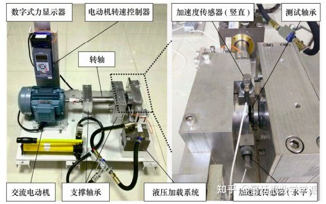
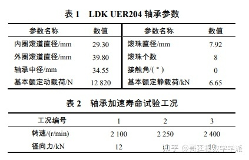
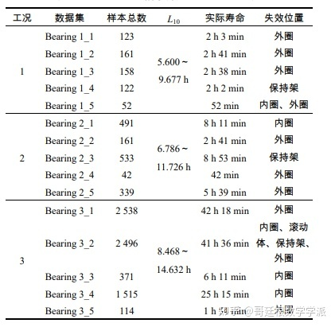
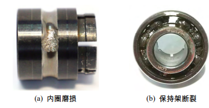
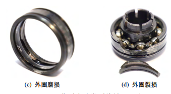
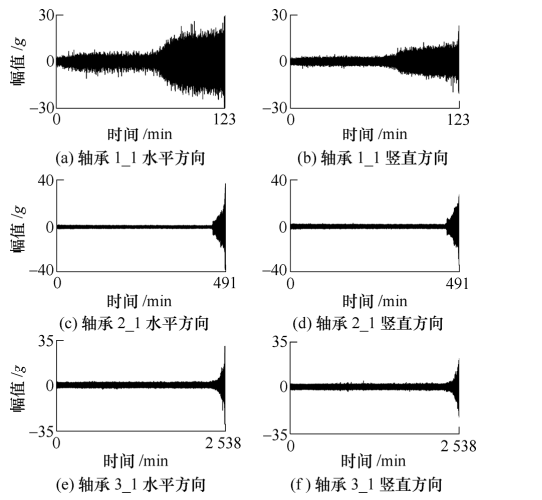
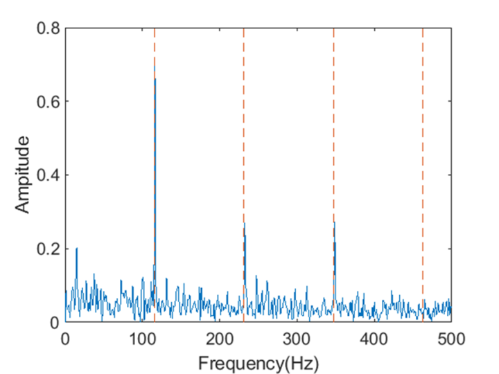
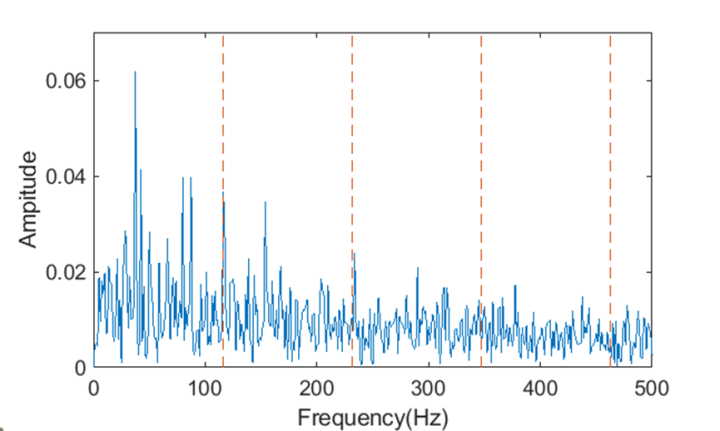
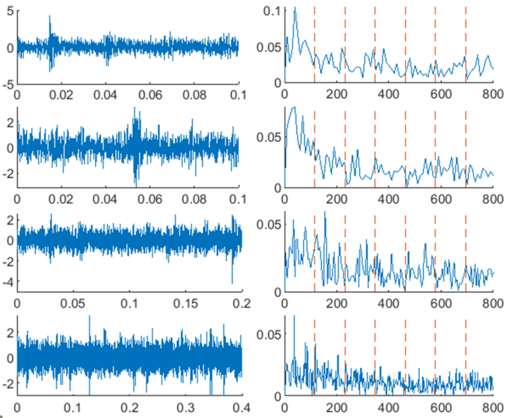
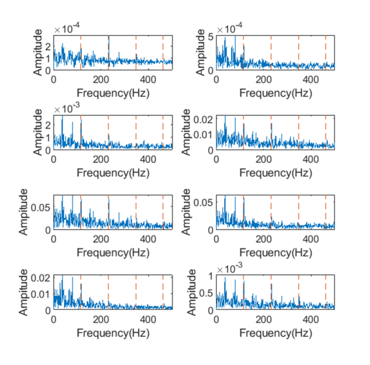
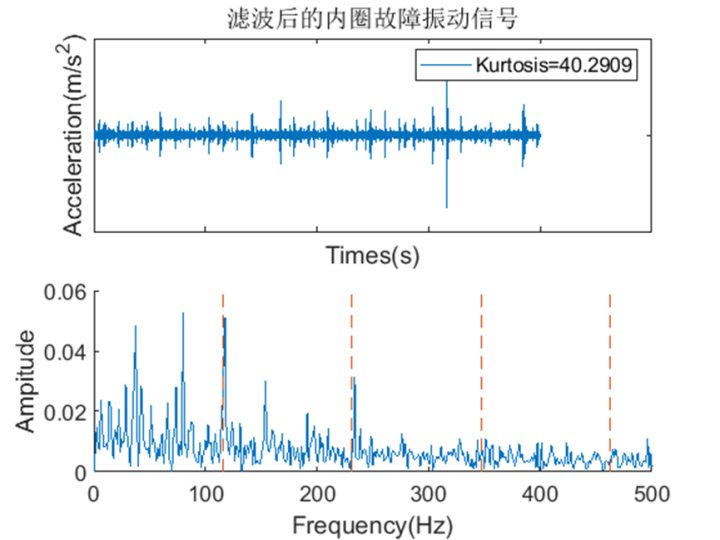
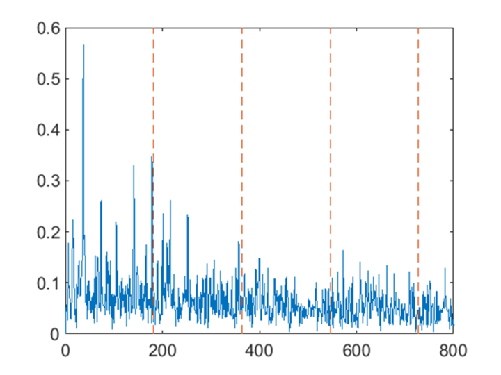
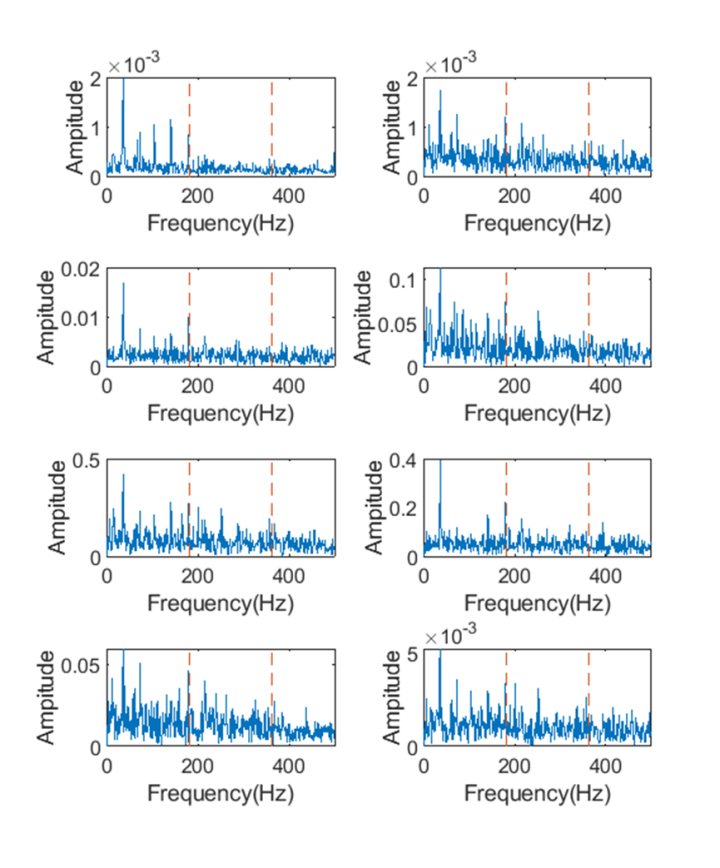
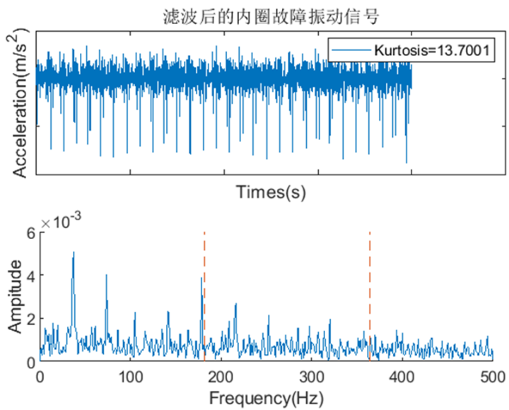
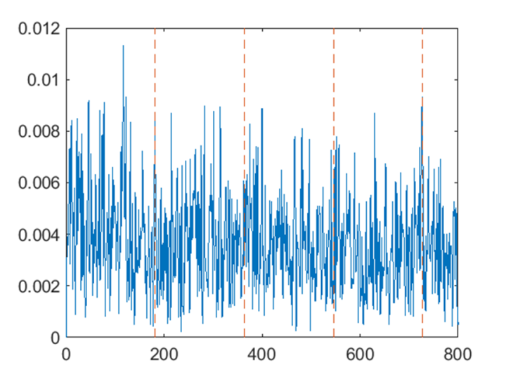
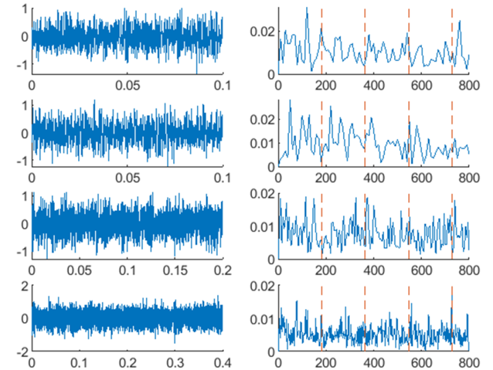
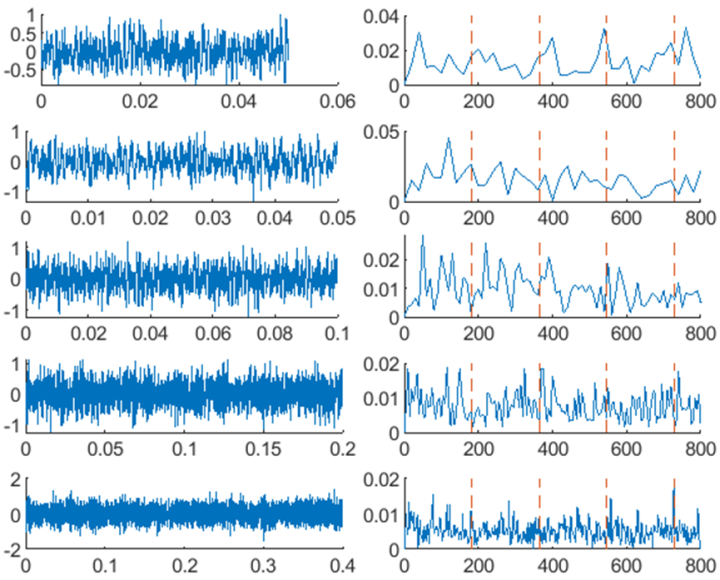
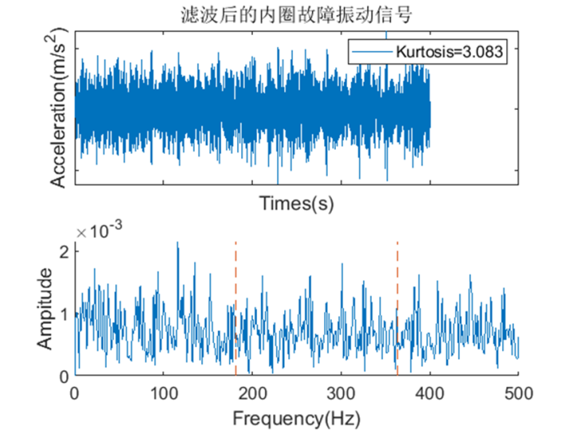

Here is a pay link on Stripe ( https://buy.stripe.com/3cs8yP7sY87d0vu9AB ). Please contact me lonlonago@foxmail.com after funding $89, and I will send you a complete data files , thank you!


